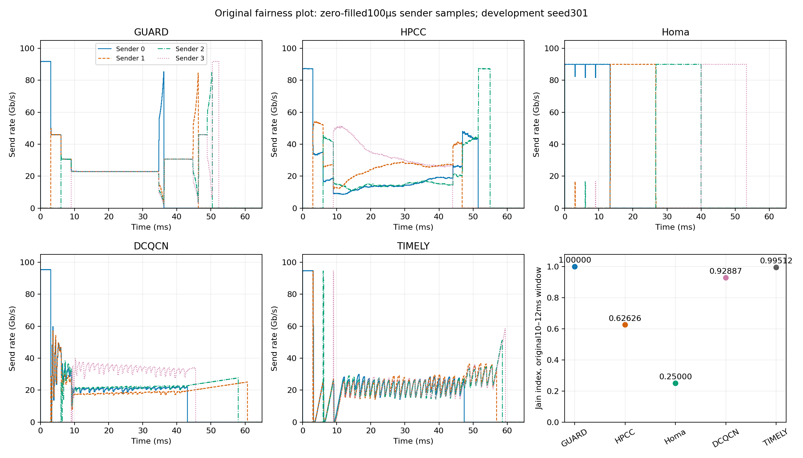
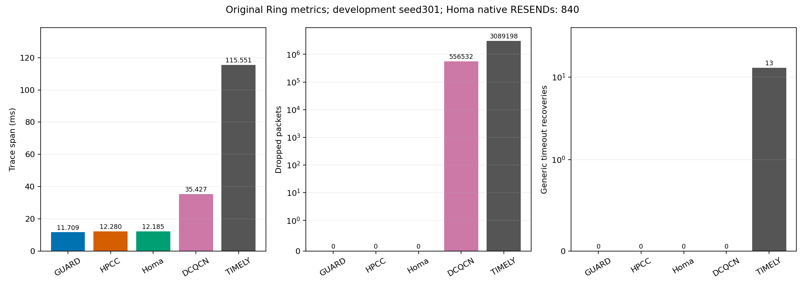

# GUARD 已验证收益与探索记录（截至 2026-09-22）

按用户要求暂停实验与优化，本次只归档已有结论、探索过程、图和复现入口。**尚未证明存在一套配置，使全部原图的指标优于 HPCC、Homa、DCQCN、Timely，或部分更优且其余持平。** 下面明确区分独立验证、开发样本收益和实现正确性修复。

本提交不改变当前运行代码或启用实验开关。源码版本以提交号和可检查的累计补丁保存。历史报告中的“继续”“active”等是当时状态；当前优化任务已暂停。

## 最新已测到的正向结果

最新完成全面核验的是接收利用率与发送端反馈系列：**65 次完整仿真，0 次仿真失败、0 丢包、0 通用 RTO**。统一使用已观察过的开发种子 301，因此以下是开发样本实测，不是新的独立确认。见[完整报告](rounds/utilization/REPORT.zh.md)、[验证记录](rounds/utilization/validation_checks.json)和[各场景数据](rounds/utilization/feedback_comparison.json)。

- **Web**：带反馈校验的条件扩并发相对同构建 K1 对照，平均 FCT 降低 **5.30%**，P99 slowdown 降低 **6.58%**，最忙端口固定窗口平均队列降低 **18.31%**；完成跨度仍增加 **0.73%**。
- **Storage30**：同一配置平均 FCT 降低 **0.56%**，P99 slowdown 降低 **0.58%**，队列降低 **6.21%**；跨度增加 **0.17%**。
- **Storage50**：同一配置平均 FCT 降低 **5.13%**，P99 slowdown 降低 **2.65%**，跨度降低 **0.85%**；队列增加 **10.50%**。这是部分改善，不能写成整图全面占优。
- **Fairness、All-to-All、Ring、完整 DP2**：这次新增策略的逐流 FCT 与全部汇总指标同 K1 精确一致。这是代码回归的相同性，不是对所有基线的统计持平结论。

上述配置仍有 **Hybrid 平均 FCT +7.78%、队列 +46.51%**，以及 Fabric、Receiver、Analytics 的部分指标回退，故保持默认关闭，未作为论文最终配置。加入反馈前的条件扩并发虽使 Storage50 平均 FCT 降低 8.35%，却使 Hybrid 平均 FCT 增加 10.96%；两轮完整结果同时保存。

## 可保留的正确性修复与机制证据

**流编号修复。** `FlowIDNUMTag` 的 32 位编号曾以 16 位写入/读出，超过 65535 后回绕。提交 `c2aedb0` 改为 U32 往返并初始化大小字段。真实 Packet 标签往返和拷贝测试覆盖 65536、65552、131088、2147483647；标签仍为 8 字节，线上数据包长度不变。这是共享模拟器的正确性修复，不能按性能是否变好决定是否保留。四个随机负载的 GUARD 和四基线共 20 次复测保留了全部性能变化；另做全场景回归。见[修复与授权诊断](rounds/grantdiag/REPORT.zh.md)、[前后对照](rounds/grantdiag/identity_comparison.json)。

**部分 ACK 批次补足。** 提交 `aa3691e` 只在现有恢复定时器进入后半周期、存在不足一批 ACK 的在途字节且允许发送时补齐原批次。Shared 配置的完整 DP2：P99 FCT **88.793→85.401 ms**，跨度 **216.534→215.002 ms**，队列 **12.478→12.259 µs**；平均 FCT **15.669→15.671 ms**，有约 0.016% 的小幅增加。λ=1 的对照将通用超时从 **3 降至 0**，但尾延迟仍有代价。真实调度器测试与干预计数均保留；不能将这些结果表述为所有指标同时改善。见[83 次实验报告](rounds/rescue/REPORT.zh.md)。

**启动速率的过期状态修复。** 新增启动共享机制曾让同机架长流保留 50 Gb/s 初值；首次 ACK 无内部网络跳数时恢复路径估计，最终发送仍受接收授权限制。Analytics 的定位流 FCT 从 **5354.454 降至 4703.576 µs**，接近关闭启动共享时的 **4702.810 µs**。它消除了新增回退的主要部分，不能单独证明整个工作负载领先。见[启动限速定位](rounds/joint/REPORT.zh.md)。

**观测工具的可信度。** 65 次系列验证了日志开关的逐流 FCT 与全部指标相同、接收 DATA 字节/包数守恒、授权配对和实际 RTT 采样窗口。反馈通过真实链路发送，控制报文字节计入成本；接收端验证授权轮次和新鲜度。不同流的授权区间会重叠，不把这些比例写成链路时间占比。发送端收到授权时的快照也不等于实际 NIC 选择事件。

## 已有四基线比较中的正向结果

以下来自 Shared rescue 的同构建、同输入开发样本，保留原图专门指标，不能用它们替代未完成的独立确认。见[原指标数据](rounds/rescue/original_metrics.json)和[完整收益及差距](rounds/rescue/REPORT.zh.md)。

- **公平性**：原 10–12 ms 公共区间 Jain 指数，GUARD **1.000000**；HPCC **0.626264**、Homa **0.250000**、DCQCN **0.928869**、Timely **0.995117**。该结论限定为原公平性指标，平均 FCT 并未全面更优。
- **Ring**：原完成跨度 GUARD **11.709459 ms**，低于 HPCC **12.279750 ms**、Homa **12.185071 ms**、DCQCN **35.426546 ms**、Timely **115.550788 ms**；GUARD 无丢包和通用超时。Homa 的原生 RESEND 单独统计，不与通用 RTO 混同。
- **完整 DP2**：GUARD 平均 FCT **15.671 ms**、跨度 **215.002 ms**，两项均低于本轮四个基线；P99 FCT 和低队列方面仍未全面占优。完整保留 1280 条流、80 个批次和每主机 2 GB。

## 较早冻结版本的独立验证收益

这些是源码 `0e3208a`、种子 **501–505** 的验证结果，不能移植成最新反馈候选的独立验证结论。该阶段完成 **494 次验证**，同时保留 312 次开发尝试及失败记录。见[完整报告](rounds/balanced/REPORT.zh.md)和[配对结果与区间](rounds/balanced/confirmation-evidence.json)。

- Storage30 的 P99 slowdown 相对 Homa 降低 **6.73%**，95% 区间为降低 **5.66%–7.80%**；平均 FCT 差异区间跨零，未证明统计等效。
- 双发送者汇聚相对 Homa，平均 FCT 降低 **1.96%**，队列降低 **97.34%**。
- 混合瓶颈相对 Homa，平均 FCT 降低 **14.35%**，队列降低 **57.46%**。
- OFLM 两项机制均开启，相对同时关闭两项，平均 FCT 降低 **12.09%**、grant 数降低 **86.66%**、平均流速率提高 **1.83%**。
- Ring 相对 Homa，完成跨度降低 **4.05%**、队列降低 **92.76%**；平均 FCT 的区间跨零，不能写成明确优势。

这套冻结配置在 Storage50、DP2 等处仍有明显回退，未作为统一最终方案。全部原图和负面结果见该轮报告。

## 探索过程索引

按实际探索顺序保留原报告、配置清单、已有分析投影、原始归档索引及作图/分析脚本：

1. [原论文场景与四基线复测](rounds/eurosys/REPORT.zh.md)：确定原始工作负载、指标、预热和完整性口径。
2. [尾部拥塞处理与作用范围](rounds/optimization/REPORT.zh.md)：修复 Ring 丢包崩溃，识别同一发送 NIC 的重复限制；后续补齐实验见该目录 `FOLLOWUP.zh.md`。
3. [有界接收调度及全场景验证](rounds/balanced/REPORT.zh.md)：公平带宽下限、统一服务范围、严格 receiver-only 消融及独立验证。
4. [流量感知/窗口/发送服务探索](rounds/flowaware/REPORT.zh.md)：保留窗口、剩余大小权重、发送服务及共享授权方案的取舍；诊断前缀不是完整 DP2。
5. [DP2 长尾与授权排序](rounds/tailtrace/REPORT.zh.md)：区分接收授权和发送路径限速，稳定排序与观测。
6. [恢复增量与启动共享](rounds/recovery/REPORT.zh.md)：保留均值、长尾和队列间的冲突。
7. [启动状态修复与组合控制](rounds/joint/REPORT.zh.md)：修复同机架启动上限残留，完整复测组合方案。
8. [ACK 超时与公平游标](rounds/timeout/REPORT.zh.md)：保留所有 90 次尝试及失败；ACK deadline 消除部分超时，却可能增加队列/PFC。
9. [ACK 批次与累计发送配额](rounds/batch/REPORT.zh.md)：修复局部调度问题，发现 All-to-All/DP2 的额外代价；未作为统一方案。
10. [定向 ACK 补足](rounds/rescue/REPORT.zh.md)：83 次完整实验、四基线与原公平性/Ring 指标，定位 Storage 大消息差距。
11. [32 位流号及固定 K=2](rounds/grantdiag/REPORT.zh.md)：44 次完整实验；保留编号修复，拒绝跨场景退化的固定 K=2。
12. [条件宽度与发送端反馈](rounds/utilization/REPORT.zh.md)：65 次完整实验；Web 等有局部收益，Hybrid 与部分队列指标仍回退。
13. [NIC 实际服务量观测](rounds/nicshare/PLAN.md)：仅实现观测提交 `9e2d872`。暂停前已启动的 10 次运行已完成，现归档驱动日志与结果记录；尚未完成服务量归因分析，**尚未实现或验证 NIC 竞争门控优化**，不作新的性能结论。

## 复现与归档边界

- [archive_index.json](archive_index.json)记录原目录、证据提交号、复制文件的 SHA-256 及源码补丁来源。
- `source_patches/` 的五个累计补丁各自以本项目原提交 **650811a90e618bf4db1b7dd160c83cc798637b7e** 为基底，均已做 `git apply --check`，本次没有应用。它们是不同源码快照，**不能依次叠加**。
- 各轮 `run_metrics.json` 是已有 `analysis.json` 的归档投影，保留每次运行的指标、身份和输出哈希；不是新实验或重新计算。逐流、分组和完整日志仍在对应原始归档，原分析 SHA-256 另存。
- 大体积原始 `raw/*.tar.gz`、工作负载输入、构建二进制与冻结的驱动快照仍位于本机 `work/guard_*_20260921/` 和各源码工作树。项目中保存原 `raw_index.json`、运行清单、哈希及分析脚本以定位它们；**本提交不是所有原始数据的独立备份**。
- 历史脚本保留当时原目录布局与路径；复制到本目录不代表可直接在这里启动实验。源码参数、构建与运行记录应按对应轮次的清单复现。
- 原随机负载仍采用 5 ms 预热并保留全部合格完成记录；Ring 仍按跨度/丢包/恢复评估；公平性仍采用原窗口；完整 DP2 不用前缀代替；不按图切换配置或只保存有利结果。

此次归档完成后保持暂停，等待用户下一步指示。
