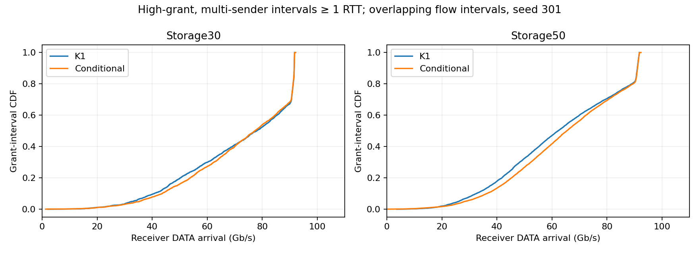
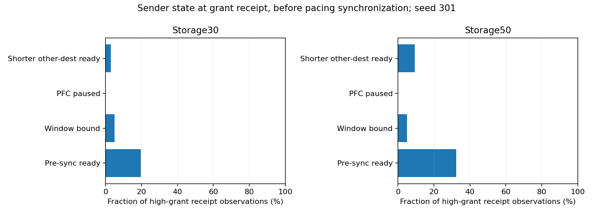
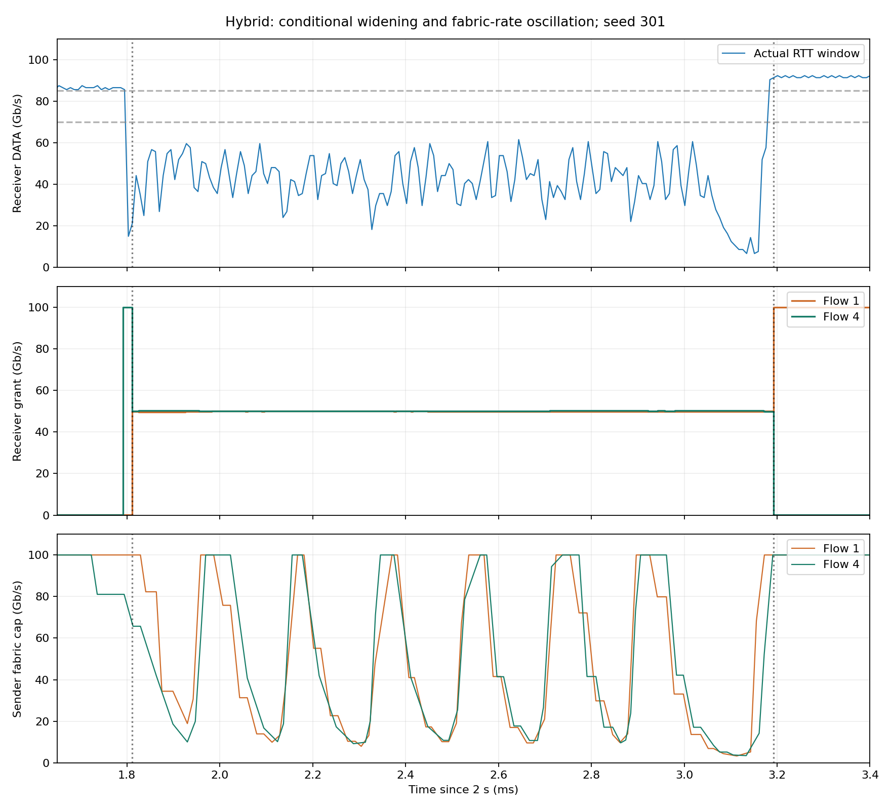
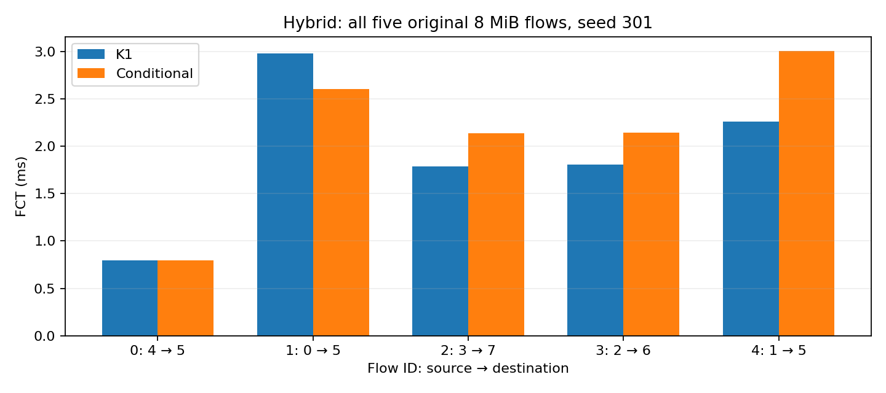
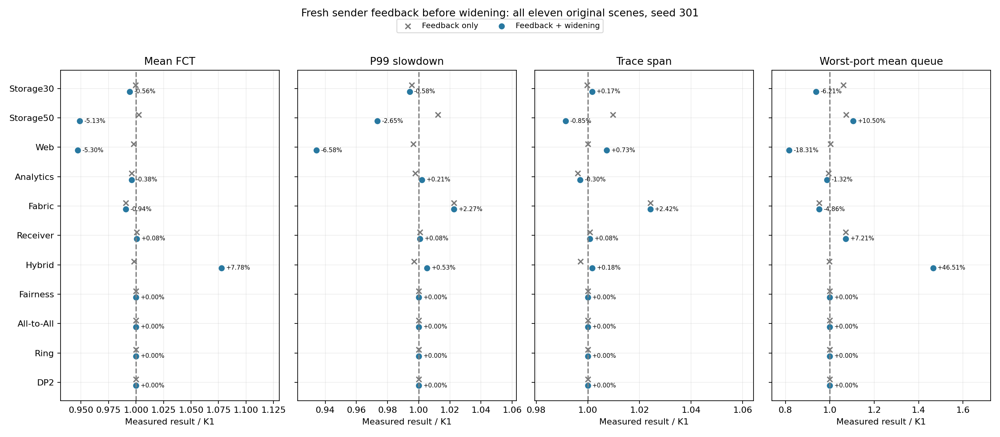
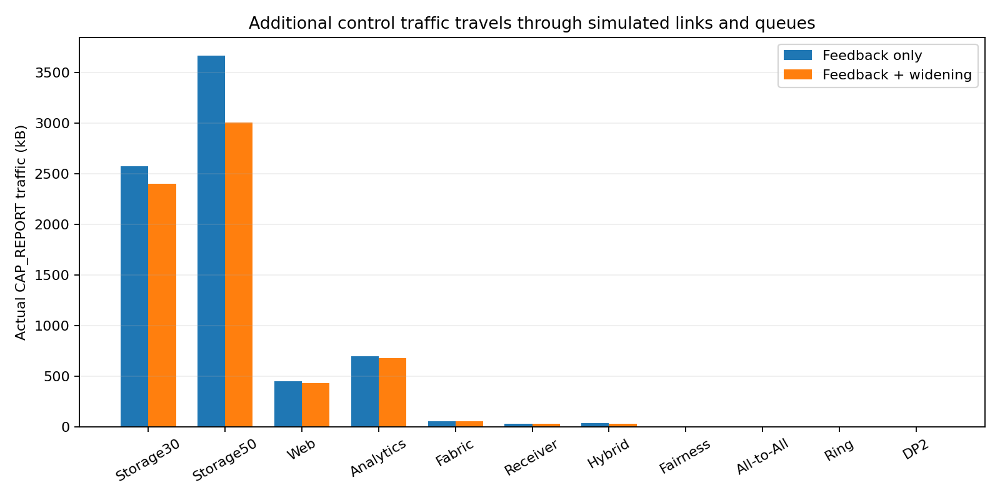

# 接收利用率与条件服务宽度诊断

本轮共 65 次完整轨迹测试全部完成：初始诊断与条件并发 30 次，发送端反馈后续对照 35 次。三个独立源码版本：只观测 8f9f6bc；可选条件并发 ef5d5a4；反馈校验 1181dd9。新增策略默认关闭。所有结果来自已观察开发种子 301，不是独立确认，也没有完成“全部图优于全部基线”的目标。

原始输入、指标及所有对照保留。DATA 接收计数覆盖全部流，包括未注册小流；逐宿主字节数与包数守恒。开启观测后完整 FCT 文件与所有指标均保持精确一致。控制器采样完成事件覆盖全部被选流，授权轨迹无上限截断。

- Storage30：多发送端且授权至少 50 Gb/s 的长授权区间共 2901 个，聚合 DATA 到达速率中位数 78.01 Gb/s；按区间长度加权，低于 50 Gb/s 的比例 31.39%。
- Storage50：多发送端且授权至少 50 Gb/s 的长授权区间共 8470 个，聚合 DATA 到达速率中位数 62.23 Gb/s；按区间长度加权，低于 50 Gb/s 的比例 47.72%。

上述区间来自不同流，会重叠，不能解读为网络空闲时间比例。收到授权时的状态是同步速率之前的观测，也不是实际 NIC 选中发送的事件。图保留这些口径。

采样器逐窗口验证记录在 width_trace_validation.json：连续窗口使用上一实际采样的 DATA 计数；新测量周期从同一时间戳记录中查找唯一速率相符的起始计数。相同纳秒发生的多个事件可具有不同累计值，不能假设时间戳决定事件顺序。

## 统一条件服务宽度实验

只在连续两 RTT 到达速率低于线速 70% 时临时增加并发服务数，连续两 RTT 恢复到 85% 时退出。所有场景使用同一规则，12-BDP 阈值、128-BDP 服务范围及其他参数保持一致。以下均为开发样本。

- Storage30：Mean FCT -0.98%；P99 slowdown -1.35%；Trace span +0.05%；Worst-port mean queue -0.74%；丢包 0→0，超时 0→0。
- Storage50：Mean FCT -8.35%；P99 slowdown -5.60%；Trace span -1.29%；Worst-port mean queue +2.42%；丢包 0→0，超时 0→0。
- Web：Mean FCT -3.25%；P99 slowdown -5.72%；Trace span +0.84%；Worst-port mean queue +4.60%；丢包 0→0，超时 0→0。
- Analytics：Mean FCT -0.38%；P99 slowdown -0.15%；Trace span -0.74%；Worst-port mean queue -1.35%；丢包 0→0，超时 0→0。
- Fabric：Mean FCT +0.00%；P99 slowdown +0.00%；Trace span +0.00%；Worst-port mean queue +0.00%；丢包 0→0，超时 0→0。
- Receiver：Mean FCT +0.00%；P99 slowdown +0.00%；Trace span +0.00%；Worst-port mean queue +0.00%；丢包 0→0，超时 0→0。
- Hybrid：Mean FCT +10.96%；P99 slowdown +1.23%；Trace span +0.79%；Worst-port mean queue +64.31%；丢包 0→0，超时 0→0。
- Fairness：Mean FCT +0.00%；P99 slowdown +0.00%；Trace span +0.00%；Worst-port mean queue +0.00%；丢包 0→0，超时 0→0。
- All-to-All：Mean FCT +0.00%；P99 slowdown +0.00%；Trace span +0.00%；Worst-port mean queue +0.00%；丢包 0→0，超时 0→0。
- Ring：Mean FCT +0.00%；P99 slowdown +0.00%；Trace span +0.00%；Worst-port mean queue +0.00%；丢包 0→0，超时 0→0。
- DP2：Mean FCT +0.00%；P99 slowdown +0.00%；Trace span +0.00%；Worst-port mean queue +0.00%；丢包 0→0，超时 0→0。

原公平性 Jain：K1 1.000000，Conditional 1.000000。Ring 按原图跨度、丢包与超时评估，不用额外均值指标替代。完整 DP2 保留所有 1280 条流及原固定队列观测窗口。逐流和所有大小区间数据仍保留；本轮结果不能替代四基线独立确认。

条件策略仍不能作为完整目标的最终配置：Hybrid 均值及队列退化，Web 和 Storage50 的队列也增加。Ring、Receiver 等未退化只说明改进了固定并发数为 2 的部分问题。保留所有变化，继续诊断 Hybrid；不按场景切换配置。四舍五入零不是统计持平结论，精确相同性另见 width_comparison.json。

## Hybrid 回退定位

两组增加观测的重跑均与各自无观测运行的逐流 FCT 和全部指标精确一致，五条原始 8 MiB 流全部完成，DATA 守恒、授权发送/接收匹配且日志无截断。

接收端 5 在相对 2 s 的 1.8116 ms 增加并发：流 1/4 各获约 50 Gb/s；3.19272 ms 退出。流 4 的发送路径限速随后低于原高授权，额外启用流 1 又增加了同一网络的竞争。这支持“低到达速率可能来自路径限速”的解释，不能仅凭利用率判断有可用容量。下一步应使用真实传输且有新鲜度校验的发送端反馈区分原因，并计入控制报文开销。

## 发送端反馈校验后的实测

在独立源码 1181dd9 上追加 33 次完整原场景对照，以及 Storage50/Hybrid 两次无行为影响的观测重跑。共 65 次。反馈必须经过真实链路传输，并带当前高授权轮次的标识；发送端要求高授权激活一 RTT 后的新完整反馈，接收端要求报告不超过两 RTT。另设只发反馈、不扩并发的对照，以区分控制报文和策略效果。

- Storage30：Mean FCT -0.56%；P99 slowdown -0.58%；Trace span +0.17%；Worst-port mean queue -6.21%；额外报告 25565 个 / 2403110 B。
- Storage50：Mean FCT -5.13%；P99 slowdown -2.65%；Trace span -0.85%；Worst-port mean queue +10.50%；额外报告 31987 个 / 3006778 B。
- Web：Mean FCT -5.30%；P99 slowdown -6.58%；Trace span +0.73%；Worst-port mean queue -18.31%；额外报告 4647 个 / 436818 B。
- Analytics：Mean FCT -0.38%；P99 slowdown +0.21%；Trace span -0.30%；Worst-port mean queue -1.32%；额外报告 7269 个 / 683286 B。
- Fabric：Mean FCT -0.94%；P99 slowdown +2.27%；Trace span +2.42%；Worst-port mean queue -4.86%；额外报告 614 个 / 57716 B。
- Receiver：Mean FCT +0.08%；P99 slowdown +0.08%；Trace span +0.08%；Worst-port mean queue +7.21%；额外报告 325 个 / 30550 B。
- Hybrid：Mean FCT +7.78%；P99 slowdown +0.53%；Trace span +0.18%；Worst-port mean queue +46.51%；额外报告 345 个 / 32430 B。
- Fairness：Mean FCT +0.00%；P99 slowdown +0.00%；Trace span +0.00%；Worst-port mean queue +0.00%；额外报告 0 个 / 0 B。
- All-to-All：Mean FCT +0.00%；P99 slowdown +0.00%；Trace span +0.00%；Worst-port mean queue +0.00%；额外报告 0 个 / 0 B。
- Ring：Mean FCT +0.00%；P99 slowdown +0.00%；Trace span +0.00%；Worst-port mean queue +0.00%；额外报告 0 个 / 0 B。
- DP2：Mean FCT +0.00%；P99 slowdown +0.00%；Trace span +0.00%；Worst-port mean queue +0.00%；额外报告 0 个 / 0 B。

原公平性窗口、Ring 的跨度/丢包/超时、完整 DP2 都继续保留；反馈报文的序列化字节数单独计数。独立观察重跑与相应无观测运行完全一致。所有数字都是同一开发种子的实测变化，未做统计持平声明。

Hybrid 仍有回退：反馈校验延后了扩并发，但发送端限速在振荡中短暂恢复到线速时仍可能给出有效的正反馈。因此这不是完整解决方案，保持默认关闭，也不替换论文的最终结果。下一步需区分发送端 NIC 的多流竞争与网络拥塞，并验证持续条件；不能仅把短暂恢复解释为稳定可用容量。

